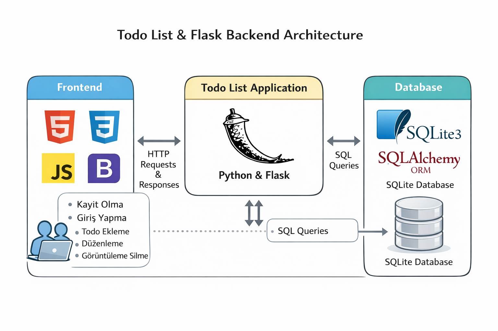

# Flask Todo List Application

Bu proje, Flask framework’ü kullanılarak geliştirilmiş, kullanıcı bazlı çalışan bir **Todo (Görev) Yönetim Uygulamasıdır**.  
Amaç; kullanıcı kimlik doğrulaması, CRUD işlemleri, durum ve öncelik yönetimi gibi temel web uygulaması kavramlarını gerçekçi bir yapı içerisinde göstermek ve portföy (CV) projesi olarak sunmaktır.

---
Projenin canlı çalışan halini görmek için aşağıdaki bağlantıyı ziyaret edebilirsiniz:
FlaskTodoList → https://flasktodolistapp.pythonanywhere.com/

---

## Proje Mimarisi


## Projenin Amacı

Flask ekosistemi, veritabanı yönetimi, kullanıcı oturumları ve temel güvenlik pratiklerini kapsayan uçtan uca bir örnek sunar.

---

## Özellikler

- Kullanıcı kayıt (register) ve giriş (login) sistemi
- Kullanıcıya özel todo listesi
- Yeni todo ekleme
- Todo güncelleme (başlık, açıklama, öncelik)
- Todo silme
- Todo durum yönetimi (aktif / tamamlandı)
- Öncelik derecesi yönetimi (low / medium / high)
- Kullanıcı bazlı erişim kontrolü
- SQLite veritabanı kullanımı
- Basit ve okunabilir template yapısı

---

## Kullanılan Teknolojiler

- Python
- Flask
- Flask-SQLAlchemy
- Flask-WTF
- Flask-Limiter
- SQLite
- HTML / CSS (Jinja2 Templates)

---

## Proje Klasör Yapısı
```
Flask-TodoList/
│
├── todo.py
├── todo.db
├── requirements.txt
├── .gitignore
│
├── static/
│ ├── css/
│ ├── fonts/
│ ├── img/
│ └── todo_images/
│
├── templates/
│ ├── includes/
│ │ ├── sidebar.html
│ │ ├── footer.html
│ │ └── active.html
│ │
│ ├── index.html
│ ├── layout.html
│ ├── login.html
│ ├── register.html
│ ├── dashboard.html
│ ├── addtodo.html
│ ├── done.html
│ └── errors.html
│
└── screenshots/
```

---

## Veritabanı Hakkında

Bu projede SQLite veritabanı (`todo.db`) repository içerisine bilinçli olarak eklenmiştir.


Amaç:
- Projeyi inceleyen kişinin ek bir yapılandırma yapmadan
- Uygulamayı doğrudan çalıştırabilmesini sağlamak
- Uygulamanın veri modeli ve işleyişini hazır hâlde gösterebilmektir

Gerçek dünya (production) projelerinde veritabanı dosyalarının repository’ye eklenmesi önerilmez.

---

## Güvenlik Notları

- Kullanıcı parolaları veritabanında hash’lenmiş olarak saklanır
- Kullanıcılar yalnızca kendi todo kayıtlarına erişebilir
- Oturum yönetimi Flask session yapısı ile sağlanmaktadır
- Rate limiting uygulanmıştır (Flask-Limiter)

---

## Geliştirme Notları

Bu proje, Flask ile gerçekçi bir web uygulaması geliştirme sürecini göstermek amacıyla hazırlanmıştır.

Kullanıcı bazlı veri yönetimi, CRUD işlemleri, durum ve öncelik mantığı gibi kavramlar sade ve okunabilir bir mimari ile ele alınmıştır.

---

## Lisans

Bu proje eğitim ve portföy amaçlıdır.


